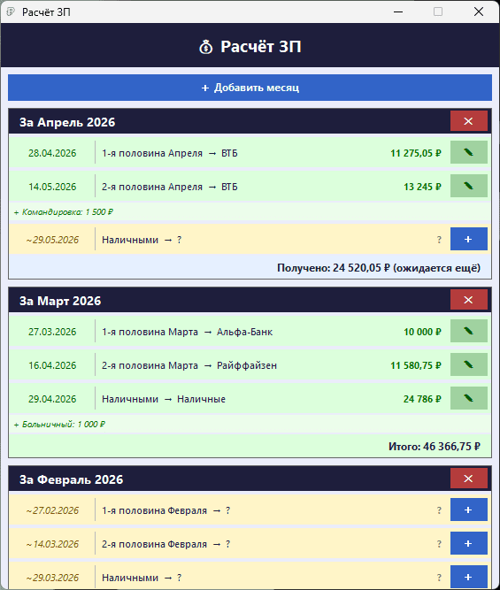
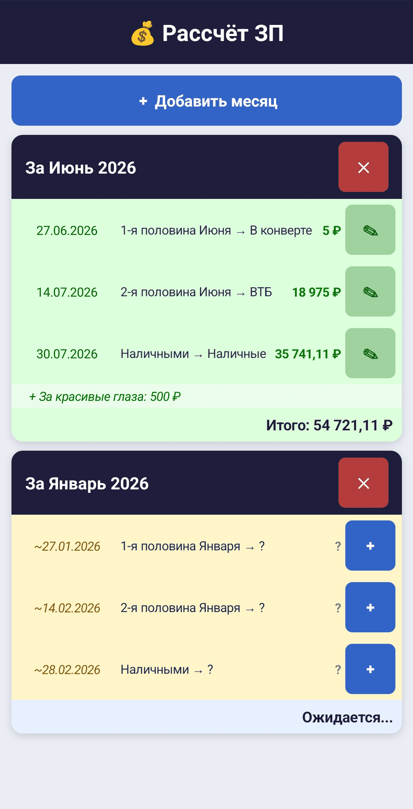

## Расчёт ЗП

Программа для расчёта ежемесячной заработной платы, разбитой на 3 части.

 

**Работает на Windows и Android**

 

**Для Windows:**

Используется: _.NET Framework 4.8_

Версия языка C#: _13.0_

**Для Android:**

Используется: _.NET MANU (.NET 9.0)_

Версия языка C#: _13.0_

Минимальная версия Android: _5.0 Lolipop_

 

_Проект полностью открыт и распространяется по лицензии MIT._

Ссылки на [GitFlic](https://gitflic.ru/project/otto/raschet-zp) и [GitHub](https://github.com/Otto17/raschet-zp).

---

**Описание:**

Программа не требует интернета, работает только с один JSON файлом для записи и чтения сохранённых данных.

Программу делал для себя на ПК, для удобного учёта заработной платы и дополнительных выплат, Android приложение делал первый раз, больше из интереса, код у них практически одинаковый.

---

 **Скриншоты:**

****
****

---

**Автор Otto, г. Омск 2026**